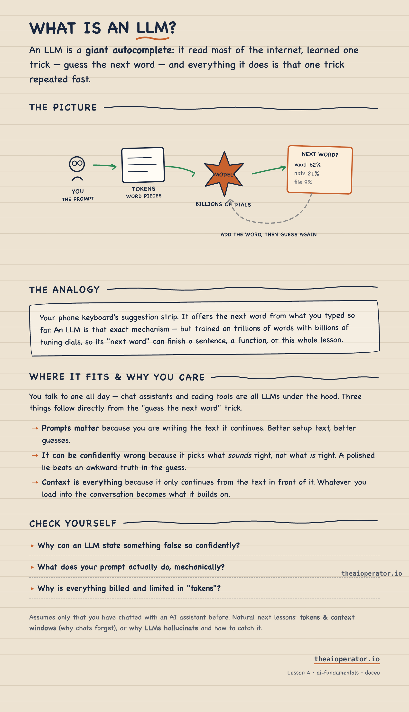
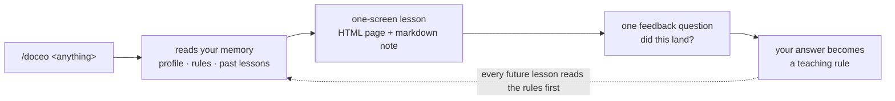

# doceo — the Claude Code skill that teaches you anything in one screen

*doceo* (Latin): **"I teach."**

An open-source **AI tutor skill for Claude Code**. Ask it anything you don't understand, a concept, a codebase, a document, a task, and instead of a wall of text you get a **one-screen visual lesson**: one plain-language answer, one diagram, one analogy, and a tiny self-quiz. Every lesson is saved to your notes, so the next lesson already knows what you learned. And it improves itself from your feedback.

```
/doceo what is an LLM?
/doceo how does OAuth actually work
/doceo https://github.com/some/repo
/doceo src/services/billing/
/doceo            <- bare: "teach me the confusing thing we're discussing right now"
```

## The pain it solves

You ask an AI to explain something new. It answers with 1,500 technically correct words. You read all of it, understand half of it, and remember none of it by tomorrow. Learning a new domain this way, a new job, a new stack, a new field, feels like being assigned a book per day.

Three things are broken in that workflow:

1. **No shape.** Explanations arrive as prose. Your brain wants a picture, an analogy, and one sentence that resolves the confusion.
2. **No memory of you.** Every chat starts from zero. The AI re-explains what you already know and skips what you actually miss.
3. **No feedback loop.** When an explanation fails you, nothing changes. The next one fails the same way.

Doceo fixes all three: fixed lesson shape, persistent learner memory, and a self-improvement loop that turns your feedback into permanent teaching rules.

## What a lesson looks like

Every lesson has the same skeleton, capped at roughly one screen:

| Part | What it gives you |
|---|---|
| **The answer** | One plain sentence at the top. Read only this and you still leave smarter. |
| **The picture** | One diagram: boxes, arrows, a "you are here" map. Drawn as inline SVG, sketchnote style. |
| **The analogy** | One real-world comparison picked from *your* world (your stack, your daily life). |
| **Where this fits** | Why this matters to you, in your project, in your role. |
| **Baby steps** | When the topic is a task: 3-5 steps, each with "done looks like". |
| **Check yourself** | 2-3 quiz questions, answers hidden behind a click. The Feynman test. |
| **Go deeper** | Optional links. Depth is opt-in, never forced. |

<!-- SCREENSHOT: full lesson page (sepia sketchnote style) -->
<!--  -->

<!-- SCREENSHOT: the diagram close-up -->
<!--  -->

You get two artifacts per lesson: a rendered HTML page to learn from, and a markdown note (with Mermaid diagrams) saved into your lessons folder. An Obsidian vault works beautifully as that folder, but any directory does.

## How it works



### The memory

A small folder next to your lessons:

- `_profile.md` — who you are, what you already know, how you like to be taught
- `_learnings.md` — teaching rules distilled from your feedback; read at the start of every run
- `_style.md` — optional: your own design system (colors, fonts, diagram vocabulary); when present, every lesson page renders in **your** brand
- `index.md` — one line per lesson, so lesson 12 assumes lessons 1-11 and links back instead of re-explaining
- `maps/<domain>.md` — one growing map per domain: everything you have learned, one picture

### The improvement loop

After every lesson, doceo asks exactly one question: *did this land?* Repeated feedback becomes rules in `_learnings.md`, and every future lesson starts by reading those rules. The skill you have after 50 lessons is not the skill you installed.

## Install

```bash
git clone https://github.com/eugeniughelbur/doceo ~/.claude/skills/doceo
```

Restart your Claude Code session once so `/doceo` appears in the slash menu.

First run asks one question (where to save lessons) and interviews you for 30 seconds to seed your profile. Config lives in `~/.doceo/config.json`, so the same skill on a second machine (say, your work laptop) keeps a completely separate memory.

## Example prompts

| You type | You get |
|---|---|
| `/doceo what is an LLM?` | Concept lesson with a next-word-prediction diagram and a phone-keyboard analogy |
| `/doceo webhooks` | Concept lesson grounded in your own stack |
| `/doceo https://github.com/fastify/fastify` | The core idea of a repo, not a file-by-file tour |
| `/doceo src/services/billing/` | What this folder does and where it fits in the system |
| `/doceo how to set up a reverse proxy` | Task lesson with baby steps and "done looks like" checks |
| `/doceo` (bare, mid-conversation) | A lesson on the thing that just confused you |

<!-- SCREENSHOT: terminal running /doceo -->
<!--  -->

## Doceo vs. other learning tools

| Tool | Great at | Doesn't do |
|---|---|---|
| **NotebookLM** | Grounded Q&A over your documents | No lesson shape, no memory of *you*, no visuals per answer |
| **DeepWiki** | Auto-generated wiki for a repo | Repos only; explains to a generic reader |
| **PocketFlow Tutorial-Codebase-Knowledge** | Turning a whole repo into a tutorial book | One-shot output; a book, not one-screen lessons |
| **doceo** | Anything → one-screen visual lesson calibrated to you, improving with every use | Not a doc generator; it teaches one person: you |

## FAQ

**What is doceo?**
A Claude Code skill that works as a personal AI tutor: it turns any topic, codebase, file, or URL into a one-screen visual lesson calibrated to what you already know.

**How is this different from just asking Claude or ChatGPT to explain something?**
Three ways: a fixed lesson shape (answer, picture, analogy, quiz) instead of free-form prose; a persistent memory of what you learned so lessons build on each other; a feedback loop that permanently changes how future lessons are taught.

**Does it only work for code?**
No. Anything you want to learn: concepts, tools, processes, papers, codebases, or the thing that just confused you in conversation.

**Where is my data stored? Is it private?**
Everything lives in local files on your machine, in a folder you choose. The skill repo contains nothing about you. Work and personal machines keep fully separate memories. Doceo is also instructed never to paste employer documents, proprietary code, or credentials into your notes; lessons capture your understanding in your own words.

**Do I need Obsidian?**
No. Any folder works. Obsidian is a nice fit because the markdown lessons use Mermaid diagrams and wiki-links, which Obsidian renders natively.

**What do I need to run it?**
Claude Code (CLI, desktop, or IDE extension). No API keys, no external services, no dependencies.

**Can I make lessons look like my own brand?**
Yes. Drop a `_style.md` with your colors, fonts, and diagram vocabulary into the memory folder and every lesson page renders in your design system.

**How does it get better over time?**
Every lesson ends with one feedback question. Your answers are logged, repeated patterns become teaching rules, and every future lesson reads those rules first.

## Privacy by design

- All memory is local, outside the repo. Nothing is uploaded anywhere.
- The skill never stores employer documents, proprietary code, or secrets; it writes your understanding in your own words.
- Separate machines, separate memories, by default.

## License

MIT. Built by [Eugeniu Ghelbur](https://theaioperator.io), an AI automation engineer shipping agents in production. More AI-builder tools and write-ups at [theaioperator.io](https://theaioperator.io).

---

*Keywords: Claude Code skill, AI tutor, personal AI teacher, learn anything with AI, visual learning, one-screen lessons, Feynman technique, teachable artifacts, developer onboarding, second brain, Obsidian learning workflow, AI explanations too long, spaced learning with AI.*
